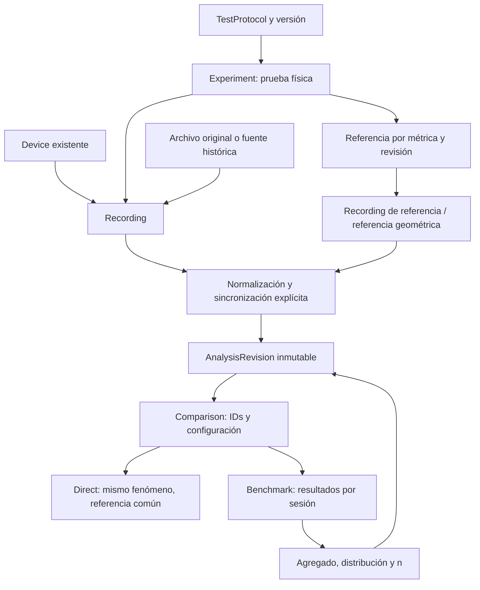

# Plan de implementación: comparativas y benchmarking de wearables

Plan inicial: 8 de septiembre de 2026. Actualización de ejecución: 9 de septiembre de 2026. Este documento conserva el alcance maestro; el estado actual del código está en el informe enlazado a continuación.

La ejecución posterior del plan está registrada en [COMPARISON_IMPLEMENTATION_STATUS.md](COMPARISON_IMPLEMENTATION_STATUS.md). Ese informe distingue código entregado, verificación realizada y alcance pendiente; este plan conserva el alcance completo solicitado.

## Condiciones actuales de ejecución

La ampliación del motor `comparison-2.0.0` cubre comparativas FC/GPS, histórico GPS/nocturno, sueño, protocolos/contexto, migración con bitácora, diagnósticos, intervalos/vueltas, ponderación, incertidumbre y exportaciones. El informe de estado distingue funciones implementadas, extensiones no incluidas y comprobaciones ejecutadas. No se considera todo el alcance maestro verificado por pasar una compilación.

La instrucción posterior del usuario excluye **validar el guardado y la reapertura en MongoDB**. Los criterios originales que mencionan esas comprobaciones quedan fuera de la validación autorizada de esta entrega. No se instala una base de datos ni un servicio en el ordenador de trabajo. Se utiliza el entorno temporal previamente autorizado y no se crean tests.

## Alcance y prioridades

Este plan traduce los dos documentos aportados, secciones 1–204, a la arquitectura encontrada. La instrucción más reciente de no implementar tests prevalece sobre las secciones que solicitan crearlos. No se añadirán suites, fixtures ni frameworks de testing. La verificación de una futura implementación incluirá compilación, revisión manual y, cuando corresponda, ejecución de los tests ya existentes.

La primera entrega funcional comprende dominio, migración, comparación directa de FC, comparación directa GPS cuando los datos lo permitan y benchmark por sesión. Las funcionalidades avanzadas tienen fases explícitas; no se consideran terminadas por dejar un campo o una pantalla vacía.

Orden de decisión: corrección metodológica → integridad de datos → reutilización → trazabilidad → claridad → rendimiento → UX → complejidad visual.

## A. Diagnóstico de la arquitectura actual

### Tecnologías y organización

| Área | Implementación encontrada | Consecuencia para el trabajo |
| --- | --- | --- |
| Frontend | Angular 17.3, componentes standalone y rutas lazy en `frontend/src/app/app.routes.ts` | Integrar nuevas páginas en la navegación y los estilos actuales. |
| Visualización | Chart.js 4.5, ng2-charts 6, ngx-charts, Angular Material; Leaflet para mapas | Reutilizar bibliotecas y utilidades; no introducir otro sistema visual. |
| API | FastAPI en `backend/main.py`, autenticación Basic opcional y API `/api` | Añadir routers y DTOs Pydantic siguiendo el contrato actual. |
| Persistencia | MongoDB, Motor; índices creados durante startup | Migraciones de documentos e índices; no SQL ni Alembic. |
| Cálculo FC | `backend/analyzer.py`, NumPy, pandas, SciPy, Matplotlib | Extraer y corregir un motor central versionado a partir del existente. |
| Despliegue | Docker multietapa; FastAPI sirve Angular compilado | Conservar el despliegue en un único servicio. |

No se han encontrado instrucciones `AGENTS.md` en la búsqueda del árbol del proyecto. El árbol de trabajo estaba limpio al iniciar la inspección. No se ha inspeccionado una base de datos activa: la estructura descrita procede del código y no garantiza qué campos tiene cada documento histórico.

### Dominio y datos existentes

| Concepto solicitado | Situación real |
| --- | --- |
| Device | Colección `devices`, nombre, descripción y `reference_name`. La referencia es un nombre asociado al dispositivo, no una grabación por métrica. |
| Workout / Session / Analysis | `sessions` combina metadatos de entrenamiento, dispositivo, dos archivos originales y un resultado mutable del análisis. Sus IDs y rutas deben conservarse. |
| Archivos | FC guarda bytes BSON y nombres de dispositivo/referencia. Hay descarga y recálculo desde esos bytes. Algunas sesiones antiguas pueden no tenerlos. |
| Experiment / Recording | No se ha encontrado entidad equivalente a una prueba física con varias grabaciones. Es necesario introducirla. |
| Protocol | `training_type` es texto libre; `sport_type` y `session_difficulty` son categorías limitadas. No hay protocolos versionados. |
| FC | Parsers FIT/TCX/GPX/HealthKit; normalización a segundos UTC; varias observaciones en el mismo segundo se promedian. |
| Datos de gráfica | `fc_data` guarda tiempo relativo, dispositivo y referencia reducidos mediante un paso de muestreo. `spark_data` es una reducción adicional. |
| GPS | `gps_tests`, `urban_tests`, `gps_scores`; modos y runs con puntos GPS. Distancias y parte de las estadísticas se calculan en Angular. |
| Referencia GPS | En pista hay distancia/geometría ideal. Urbano conserva `ref_points` con latitud/longitud; esa referencia geométrica no aporta timestamps. |
| HRV y FC nocturna | `nocturnal_hrv_sessions` guarda ventanas, resúmenes, ajustes y archivos opcionales. Gran parte del procesamiento está en el componente Angular nocturno. |
| Sueño | No se ha encontrado modelo de épocas ni motor de clasificación de sueño. |
| Potencia / cadencia / laps | Los archivos podrían contenerlos, pero el pipeline FC inspeccionado no los expone como canales o intervalos reutilizables. Hay que extraer solo lo realmente presente. |
| Comparativas | Existen overview, scores y agregados; no un objeto guardable con selección de grabaciones, referencias por métrica y versiones de análisis. |

### Métricas, sincronización y riesgos encontrados

`calculate_metrics()` ya calcula MAE, MAPE, RMSE, bias, límites de acuerdo, CCC, ICC, Pearson/p, regresión, medias y porcentajes dentro de ±3/5/10 bpm. También hay análisis por zonas, estimación de lag y análisis de intervalos. Los resultados y gráficas se persisten en la sesión; los agregados se obtienen dinámicamente.

`generate_sport_aggregate()` ya distingue agregado equilibrado por sesión y ponderado por muestras. Se reutilizará su contrato y lógica válida: no es necesario inventar de nuevo la macroagregación. Los scores editoriales por dificultad no se convertirán en métricas de precisión del nuevo benchmark.

Problemas concretos que deben resolverse antes de utilizar el histórico como evidencia homogénea:

1. `align()` alinea correctamente por UTC, pero usa `interpolate()` sin límite de gap. No permite auditar interpolación ni cobertura real.
2. `analyze_session()` descarta el inicio UTC de la ventana alineada. `activity_date` refleja el inicio del dispositivo; no equivale necesariamente al inicio de `fc_data`. No reconstruir la línea absoluta sumando ambos sin evidencia.
3. La normalización actual colapsa la resolución subsegundo. Conviene reutilizar la lectura de formatos y separar registros originales de la transformación a 1 Hz.
4. CCC mezcla varianzas muestrales con una covarianza normalizada por n. Antes de reutilizarlo como resultado del nuevo motor hay que unificar el estimador.
5. ICC no conserva su especificación metodológica. El nuevo módulo no lo ofrecerá como un ICC genérico.
6. El signo y la ventana de `estimate_lag()` necesitan revisión, incluyendo sesiones cortas. El lag no demuestra por sí solo un error de reloj.
7. Los resultados se redondean al calcular. Los nuevos conservarán precisión completa; los históricos mantendrán su precisión original identificada.
8. Recortar o reanalizar sobrescribe el resultado de `sessions`. Los snapshots requieren revisiones inmutables antes de conservar enlaces a esos resultados.
9. Borrar dispositivo o sesión puede borrar archivos usados por otras vistas. Las nuevas referencias compartidas requieren política de archivado y comprobación de dependencias.
10. GPS contiene fórmulas y percentiles repartidos entre servicios/componentes; referencias geométricas y temporales deben distinguirse.
11. HRV incluye scores derivados de Pearson en el overview. No heredarlos como puntuación de acuerdo o precisión del nuevo módulo.

## B. Modelo de datos propuesto

Conservar `devices`, `sessions`, `gps_tests`, `urban_tests` y `nocturnal_hrv_sessions`. Introducir documentos de dominio pequeños que referencien las fuentes existentes. No copiar series ni bytes por cada comparativa.

| Colección / registro | Campos y responsabilidad |
| --- | --- |
| `devices` existente | Añadir opcionalmente marca/modelo/revisión de hardware. Firmware, muñeca, ubicación y ajustes utilizados pertenecen a cada grabación. No identificar dos unidades físicas solo por su nombre comercial. |
| `experiments` | `_id`, nombre, inicio/final UTC, zona horaria original, deporte, participante opcional conocido, protocolo/version, contexto, notas, eventos y estado de agrupación. Representa una prueba física. |
| `recordings` | `_id`, `device_id` nullable si la identidad no consta, `device_label`, `experiment_id` nullable, `source_locator`, fingerprint, canales disponibles, inicio/final UTC nullable, metadatos de muestreo, firmware/GNSS/sensores y procedencia. |
| `experiment_metric_references` | `experiment_id`, definición/version de métrica, `recording_id` o referencia geométrica, tipo/calidad, notas, evidencia y revisión. Una referencia activa por métrica y experimento; conservar revisiones anteriores. |
| `reference_assets` | Solo para referencias que no son grabaciones: geometría, distancia medida, pista/carril o futura referencia externa. Tipo explícito, unidad, método, fuente y revisión. |
| `test_protocols` | Identificador estable, versión, categoría, deporte, condiciones, especificación de intervalos, definiciones admitidas y criterios opcionales. No modificar una versión publicada. |
| `analysis_revisions` | IDs de recording/referencia/experimento/sesión fuente; métrica; versiones de parser/motor/metodología; ventana, offsets, interpolación, máscaras; métricas, calidad, fecha y huella de entradas/configuración. Documento inmutable. |
| `comparisons` | Nombre, `DIRECT`/`BENCHMARK`, `LIVE`/`SNAPSHOT`, selección explícita, filtros, política de sesiones, agregación, referencias/versiones, configuración visual, intervalo, exclusiones y fechas. Sin datos brutos. |
| `comparison_revisions` | Configuración y lista resuelta de analysis IDs/versiones al guardar un snapshot o una revisión. Una selección dinámica de un live queda registrada al exportar/congelar. |
| `migration_runs` | Versión de migración, estado, cursor, IDs creados/modificados y contadores de incidencias. Permite reanudación y rollback selectivo. |
| `MetricDefinition` / `StatisticDefinition` | Catálogos versionados en backend expuestos por API: definición, unidad, naturaleza medida/derivada, fórmula, interpretación, compatibilidad y visualizaciones. |

`source_locator` será una unión validada por tipo: sesión FC + lado del archivo; run GPS + ID estable; ventana/fuente nocturna. No aceptar nombres arbitrarios de colección/campo del cliente. Para los bytes históricos se conserva la localización actual; un futuro almacén compartido de archivos podrá cambiar esa localización sin cambiar el ID de Recording.

Un fingerprint idéntico prueba igualdad de contenido, no por sí solo identidad del dispositivo, participante o experimento. Se puede reutilizar un archivo; la deduplicación de Recording exige identidad/procedencia coherentes. Dos archivos de referencia de nombre «Polar H10» no demuestran una referencia común.

Las referencias históricas sin calidad documentada tendrán calidad desconocida (`null`), nunca `GOLD_STANDARD` ni una validación inventada. Las calidades configurables serán las cinco solicitadas. Referencias futuras por métrica no cambiarán resultados anteriores.

Tipos de dato: timestamps absolutos UTC en milisegundos o datetimes con zona en los contratos; duraciones en segundos; medidas numéricas finitas o `null` con motivo; IDs serializados como strings. No utilizar cero para NO DATA. El formato UI procede del catálogo de unidades.

## C. Reutilización y cambios en archivos

| Estructura actual | Tratamiento propuesto |
| --- | --- |
| `backend/analyzer.py` | Extraer parsers/normalización y fórmulas válidas a módulos compartidos; mantener funciones públicas como adaptadores compatibles. Las correcciones cambian versión, no reescriben silenciosamente resultados históricos. |
| `backend/main.py` | Montar router de comparativas antes de la ruta comodín que sirve Angular. Conservar autenticación, acceso DB, APIs actuales y serialización compatible. Adaptar subida, recálculo, recorte y borrado para mantener linaje. |
| `generate_sport_aggregate()` | Reutilizar base de agregación por sesión; centralizar media/SD y completar mediana, cuantiles, IQR y n específico de cada métrica. |
| `GpxParserService` y geometría GPS | Reutilizar lectura/representación y modelos. Extraer lógica de visualización; trasladar cálculo persistido a un motor GPS backend común, con versión legacy para resultados anteriores. |
| `fc-temporal-chart` | Generalizar contrato a múltiples series nullable sin romper las dos entradas actuales, o extraer un chart base compartido. Referencia identificada por ID/rol, nunca por posición fija en un array. |
| `session-validation-charts`, `metrics-table` | Reutilizar estructuras y presentación, adaptando valores nullable, n, unidades y fuente. Evitar copiar fórmulas al frontend. |
| Leaflet y vistas GPS | Extraer capas/mapa reutilizable, preservando herramientas de pista y urbano. Mostrar trayectorias sin suavizado y sin segmentos que atraviesen gaps. |
| `shared/chart-export.ts` | Reutilizar PNG en alta resolución. Mantener atribución cartográfica cuando se admita exportar mapas. |
| `ApiService`, rutas, navegación y páginas fuente | Extender con DTOs tipados, acceso a Comparativas y acciones «Comparar sesión» / «Comparar dispositivo». |
| Componente HRV nocturno | Extraer progresivamente cálculos/contratos hacia el motor común; conservar importadores y UX actual. |

Estructura nueva prevista:

```text
backend/comparisons/
  router.py             # endpoints y DTOs de entrada/salida
  models.py             # tipos de dominio y validación
  repository.py         # queries, índices y revisión de dependencias
  service.py            # selección, referencias, revisión y caché
  sources.py            # adaptadores de datos históricos
  synchronization.py    # timestamps, offsets, muestreo y máscaras
  statistics.py         # resultados por sesión y agregado
  gps.py                # distancias y errores GPS
  definitions.py        # métricas, estadísticas, unidades y protocolos
backend/migrations/
  comparison_domain_v1.py
frontend/src/app/models/comparison.model.ts
frontend/src/app/services/comparison.service.ts
frontend/src/app/pages/comparisons/
frontend/src/app/shared/comparison-charts/
COMPARISON_METHODOLOGY.md
```

Son rutas propuestas, no archivos ya presentes. No se creará una capa separada por cada nombre del documento si puede resolverse mediante una estructura compartida.

## D. Migraciones y conservación del histórico

Migración aditiva, idempotente, por lotes y con `--dry-run` por defecto. No ejecutar un backfill completo al arrancar el servidor.

1. **Inventario:** contar sesiones/archivos disponibles, análisis recortados, GPS sin timestamps, referencias conocidas y errores de lectura. Generar informe sin exponer datos brutos ni credenciales.
2. **Índices y catálogos:** registrar versión del esquema y protocolos iniciales. Crear índices por dispositivo/fecha, experimento/canal, source locator único, protocolo/version y huella única de revisión analítica. Referencias activas con restricción única por experimento/métrica.
3. **Recordings FC:** crear localizadores a ambos archivos existentes; guardar hash y metadata realmente extraída. No copiar los bytes ni inventar un dispositivo de referencia a partir de un nombre.
4. **Snapshot histórico:** preservar exactamente las métricas actuales en una revisión `legacy-unversioned`, incluyendo ventana recortada, precisión conocida y limitaciones. No atribuir al pasado una versión de algoritmo que no consta.
5. **Vínculos:** añadir campos opcionales a `sessions` hacia recordings y revisión actual. Mantener `_id`, referencias previas, nombres y rutas. `experiment_id = null` hasta tener una asociación explícita o inequívoca.
6. **GPS/nocturno:** añadir IDs estables a runs/ventanas donde falten; crear adaptadores y linaje a su colección fuente. Marcar «archivo original no conservado» cuando solo haya puntos o ventanas, sin fingir un hash de bytes inexistentes.
7. **Clasificación asistida:** usar deporte/dificultad para sugerir categoría; no inferir «10 × 400 v2» de un texto «series». Las coincidencias temporales son sugerencias de asociación.
8. **Nuevas operaciones:** subida y recálculo materializan el nuevo dominio una sola vez. Toda revisión se completa antes de actualizar el puntero actual. Las operaciones parciales son reintentables mediante claves idempotentes.
9. **Rollback:** revertir únicamente vínculos/índices/documentos creados por esta migración que no tengan uso posterior. No borrar análisis, experimentos o comparativas creados después. Con dependencias, mantener compatibilidad y registrar rollback parcial.

Cambiar referencias o recortar conserva la revisión previa. Los archivos y revisiones alcanzables desde snapshots se archivan en vez de eliminarse en cascada. No hacer que una comparación dependa de que su sesión de origen siga visible en un listado.

La disponibilidad de MongoDB, copia de seguridad, permisos y transacciones del entorno se verificará antes de aplicar datos. Se preferirán operaciones atómicas por documento y escrituras idempotentes para no depender de transacciones multidocumento no comprobadas.

## E. Flujo de datos



La flecha del agregado al análisis indica navegación de procedencia. Una sesión histórica puede producir Analysis sin Experiment confirmado. Benchmark es un modo de Comparison, no una nueva copia del dataset.

## F. Plan por fases y criterios de cierre

### Fase 0 — Contratos y decisiones metodológicas

Entregar DTOs, catálogo de métricas/unidades, estados de falta de datos, contrato de procedencia y `COMPARISON_METHODOLOGY.md`. Definir configuración por protocolo; fijar significado de cobertura, interpolación, offsets y agregados antes de construir pantallas.

Cierre: cada número previsto tiene unidad, definición, denominador, fuente y política de n insuficiente. El inventario identifica qué resultados son legacy y cuáles pueden regenerarse desde originales.

### Fase 1 — Dominio, migración y revisión de resultados

Implementar colecciones/adaptadores anteriores; migración dry-run/aplicación/rollback; conservación de IDs; referencias por métrica; protocolos versionados. Integrar nuevas subidas sin exigir volver a importar el histórico. Añadir selección/edición de experimento y protocolo, con evidencia explícita para agrupaciones manuales.

Cierre: una prueba puede contener varios dispositivos y distintas referencias para FC/GPS; sesiones sin relación conocida siguen abriendo. El backfill puede repetirse sin duplicados. Recálculo/recorte conservan revisiones y no dejan snapshots sin origen.

### Fase 2 — Motor común y API de selección

Extraer el cálculo reutilizable. Registrar versión y huella de entradas/configuración; calcular fuera del event loop las operaciones pesadas y limitar duración, dispositivos y tamaño de solicitudes. Elegir ejecución en background según las mediciones de carga, sin introducir una cola por defecto.

API propuesta, paginada y con proyecciones de metadatos:

| Operación | Ruta propuesta |
| --- | --- |
| Dispositivos comparables y categorías comunes | `GET /api/comparison-options/devices`, `GET /api/comparison-options/common-protocols` |
| Protocolos y definiciones | `GET /api/comparison-definitions`, `GET /api/test-protocols` |
| Experimentos, detalle y creación | `GET/POST /api/experiments`, `GET /api/experiments/{id}` |
| Asociar grabaciones y referencias | `PATCH /api/experiments/{id}`, `PUT /api/experiments/{id}/references/{metric}` |
| Grabaciones y experimentos comunes | `GET /api/recordings`, `GET /api/comparison-options/common-experiments` |
| Validar selección y previsualizar | `POST /api/comparisons/preview` |
| Guardar, listar, recuperar y revisar | `POST/GET /api/comparisons`, `GET/PATCH /api/comparisons/{id}` |
| Datos directos / agregados | `GET /api/comparisons/{id}/direct-data`, `GET /api/comparisons/{id}/benchmark-data` |
| Procedencia / análisis original | `GET /api/analysis-revisions/{id}`, `GET /api/analysis-revisions/{id}/provenance` |
| Recalcular / congelar | `POST /api/comparisons/{id}/recalculate`, `POST /api/comparisons/{id}/snapshots` |

El backend valida modos, pertenencia de cada grabación, definición de métrica, referencias, intervalos y versiones. El payload de benchmark no ofrece una serie común con la que pueda construirse un overlay accidental.

Cierre: resultados existentes se reutilizan por ID/version; solo se recalculan si faltan o cambian ventana, referencia, sincronización, máscaras o metodología. Resultados incompatibles se separan o muestran como tales, sin promediarlos silenciosamente.

### Fase 3 — Comparación directa de frecuencia cardíaca

Crear listado, selector de modo, creación manual por dispositivo/entrenamiento y creación desde Experiment. Permitir 2+ dispositivos y una sola serie de referencia.

Pipeline:

1. Leer registros originales, ordenar timestamps, conservar resolución de origen y documentar tratamiento de duplicados/valores inválidos.
2. Resolver referencia FC y estado `VERIFIED`, `ASSUMED` o `CONFLICT`. Mismo experimento y misma referencia explícita verifican; similitud de nombres/fechas no.
3. En creación manual sin evidencia suficiente, registrar la declaración del usuario y la referencia elegida. Si hay evidencias contradictorias, mostrar el conflicto; la creación ordinaria no transforma fechas incompatibles en una misma prueba. Un override exploratorio explícito debe guardar motivo y no aportar evidencia verificada al benchmark.
4. Resolver clock offset: NONE por defecto; MANUAL con segundos y razón; AUTO solo con evidencia de reloj independiente del comportamiento del sensor. Correlación FC por sí sola no separa clock offset y measurement lag. Guardar valor original/propuesto/aplicado, método, confianza y confirmación.
5. Definir ventana UTC común; admitir selección acotada. Mostrar también cobertura respecto a duración de cada grabación para no ocultar inicios tardíos al intersectar ventanas.
6. Resamplear a frecuencia definida, inicialmente 1 Hz. Interpolación NONE por defecto; LINEAR opcional solo entre extremos válidos y cuando el hueco completo cumpla el límite configurado. Sin extrapolación ni relleno parcial de gaps largos.
7. Aplicar máscaras versionadas de referencia compartida y dispositivo. Contar por separado muestras observadas, interpoladas, referencia inválida y ausencia del dispositivo.
8. Calcular métricas sobre pares válidos del dataset analítico; reducir únicamente datos de render manteniendo límites de gap y extremos relevantes.

Métricas: N, expected pairs, coverage, missing duration, longest gap, gap count; bias, MAE, MedianAE, RMSE, P90AE, P95AE, máximo AE, SD de errores y porcentajes ±3/5/10. MAE/RMSE/coverage siempre juntos. Para 0 pares: métricas `null`; para 1: medias/errores definibles, SD/CCC/Pearson/LoA no estimables.

UX: FC grande, error con signo bajo ella, referencia única, colores estables por dispositivo, tooltip temporal con delta firmado, crosshair, zoom/pan/reset, ocultar series, fullscreen, selección temporal y apertura del análisis/archivo original. Bandas ±3/5/10 opcionales y descriptivas. Sin suavizado por defecto.

Cierre: completar los pasos FC del caso A y guardar/reabrir la selección, referencia, configuración e intervalo. La referencia no se duplica y un gap de 20 segundos sigue siendo visible y reduce cobertura.

### Fase 4 — Comparación directa GPS

Añadir pestaña GPS a la misma selección. Extraer GPS de FIT/TCX/GPX cuando esté en los originales, y adaptar runs ya guardados. No exigir volver a importar sesiones con datos suficientes.

Centralizar en `gps.py`: distancia registrada cuando exista, distancia derivada de coordenadas identificada como tal, diferencia firmada/absoluta/porcentual en tramos comparables, número de puntos, mediana de intervalo, gaps y cobertura. No unir tramos separados por gaps para obtener una distancia presentada como completa.

Referencia temporal: error horizontal entre posiciones emparejadas por timestamp y tolerancia/método explícitos; mean, median, RMSE, P90, P95 y max. Referencia geométrica: cross-track, distancia y vueltas; no etiquetar distancia a la polilínea como error de posición temporal. Sin referencia: mostrar trayectoria/distancia disponibles y NO DATA en error.

Reutilizar Leaflet con capas por dispositivo, referencia una vez, inicio/final, tooltips, ocultación, zoom/pan/fullscreen y gaps. Incorporar gráfica de error temporal y cursor compartido mapa/gráfica. Las vistas por distancia y selección desde mapa llegan en fase 6 si no caben aquí.

Cierre: completar los pasos GPS del caso A. Una referencia urbana sin tiempos solo permite métricas geométricas; cambiar de FC a GPS no presupone la misma referencia.

### Fase 5 — Benchmark histórico funcional

Seleccionar dispositivos y protocolo/categoría; modos de sesión concreta, seleccionadas o todas compatibles. Mostrar categorías comunes y estados EXACT PROTOCOL / SAME CATEGORY / SIMILAR CONDITION / DIFFERENT PROTOCOL, con razones y un estado desconocido cuando falten metadatos. Versión igual y nombre igual no compensan condiciones obligatorias incumplidas.

Consumir análisis persistidos de cada sesión frente a su propia referencia. Unidad por defecto: una sesión física por dispositivo y protocolo. Evitar que dos recortes o revisiones de la misma sesión se cuenten como dos sesiones independientes.

Calcular mean, median, SD muestral, Q1/Q3, IQR, min, max y n válido por métrica. Mostrar también sesiones seleccionadas/sin dato/excluidas. No llamar P95 AE a un percentil de MAE entre sesiones: distinguir estadística intrasesión de resumen entre sesiones.

UI: tabla, dot plot con cada sesión inspeccionable, mediana e IQR, filtros por protocolo y versión, fecha, firmware, referencia/calidad y contexto disponible; heatmap actividad × dispositivo con unidad/escala/dirección. Cada punto/celda abre sesiones y análisis responsables. Vistas individuales o lado a lado con su propia referencia y sin sincronización entre entrenamientos independientes.

Cierre: completar los casos B y C. Una sesión de 10 min con MAE 1 y otra de 100 min con MAE 5 producen media por sesión 3. No se crea overlay común. Guardar/reabrir conserva selección y configuración; snapshot fija IDs/versiones.

**Entrega base funcional:** fases 0–5 cerradas con recorridos A/B/C, build y revisión manual. Las siguientes fases extienden esta base.

### Fase 6 — Análisis avanzado e interacción

Completar scatter con identidad, Bland–Altman descriptivo, CCC corregido/versionado, Pearson como asociación, ECDF/histograma, lag diagnóstico con correlación a cero/máxima/ventana y estado no estimable cuando no haya variación suficiente. La señal principal nunca se desplaza por el lag estimado.

Añadir small multiples con escalas compartidas solo en Direct, error absoluto, marcadores, laps/intervalos reales, tabla por intervalos, buckets de intensidad, subida/estable/bajada y análisis de transitorios (detección, 50/90%, overshoot/undershoot).

GPS: cross-track si queda pendiente, along-track con restricciones de recorrido, errores por vuelta y repetibilidad, vista por distancia, mapa coloreado con escala y selección bidireccional mapa/gráfica. Hausdorff/Fréchet se reservan para diagnóstico exploratorio y carga acotada.

Cierre: cada interacción identifica si cambia el cálculo o solo la visualización; seleccionar una región genera/reutiliza su revisión sin sobrescribir la sesión completa.

### Fase 7 — Incertidumbre, evidencia y ponderaciones

Bootstrap por sesión/experimento y, si existen varios participantes, estructura de clustering acorde con ese diseño. Bloques temporales solo con criterio documentado de tamaño y supuestos. Guardar semilla, repeticiones, método, unidad de remuestreo y versión. No emitir CI inferenciales a partir de cada segundo supuesto independiente.

Añadir modos por duración, pares válidos o pesos manuales con fórmula visible y conjuntos elegibles documentados; conservar la macroagregación como predeterminada. Exclusiones con motivo, autor disponible, fecha, regla, valor original y ámbito; nunca eliminar outliers automáticamente.

Rankings únicamente por métrica/protocolo/criterio, n y cobertura visibles. Umbrales de rendimiento configurables y versionados; insights descriptivos enlazados a evidencia. No introducir score global arbitrario ni conclusiones generales sobre «el mejor reloj».

Cierre: cualquier CI, ponderación o clasificación puede reconstruirse desde sus sesiones, configuración y versión; n insuficiente se comunica explícitamente.

### Fase 8 — Noches, HRV, FC nocturna y sueño

Adaptar el histórico nocturno conservando fuentes/ventanas. Definición estricta por métrica, unidad, duración, periodo, agregación y corrección de artefactos. Emparejar noches por ventana absoluta y zona horaria, incluyendo cruces de medianoche y cambios horarios. No confundir fecha de subida con noche medida.

Direct por noches realmente coincidentes; benchmark por resultados de noches. No mezclar RMSSD/SDNN ni ventanas de 5 min/noche completa. Calcular acuerdo y n nights; no reutilizar un score de Pearson como precisión.

Sueño: crear importación/adaptador de épocas y referencia cuando haya datos, mapping versionado de etapas, alineamiento de épocas y cobertura; matriz de confusión y métricas por clase, acuerdo/kappa cuando proceda. ICC solo si se explicita modelo/tipo/definición y el diseño lo permite. Métricas propietarias no equivalentes quedan fuera de agregados de precisión.

Cierre: comparativas basadas en definiciones compatibles y noches/épocas presentes. La ausencia actual de PSG o etiquetas no se sustituye con datos inventados.

### Fase 9 — Exportación, rendimiento y finalización

CSV de métricas/fuentes, JSON de comparación y revisiones, PNG usando exportación actual. Guardar filtros, selección, intervalo, agregación, visibilidad y zoom opcional. Snapshot para publicaciones congela evidencia y fecha sin copiar datos brutos.

Preparar exportación para vídeo 16:9/1080p/4K como extensión; SVG solo si la representación lo soporta. Exportación de mapa condicionada a capacidades y licencia/atribución del proveedor.

Medir consulta/render con 1–3 horas y varios dispositivos, caché fría/caliente y mayor frecuencia cuando existan archivos adecuados. Limitar puntos de render, preservar gaps, cargar GPS/avanzados bajo demanda y evitar enviar todos los binarios/gráficas base64 en listados. Las estadísticas utilizan siempre la resolución analítica configurada, nunca el dataset reducido del chart.

Cierre: informe de comandos/verificación, limitaciones, rendimiento observado, migración aplicada o pendiente y funcionalidades avanzadas realmente disponibles. No dar por verificado un flujo que no se haya podido abrir con API/DB funcionales.

## G. Riesgos técnicos y mitigaciones

| Riesgo | Medida prevista |
| --- | --- |
| Sesiones históricas sin originales o sin tiempos absolutos | Reutilizar métricas como legacy; deshabilitar recálculo/overlay no reconstruible y explicar la carencia. |
| Referencias binarias duplicadas en sesiones diferentes | Referenciar contenido existente y deduplicar identidad solo con evidencia; ninguna copia nueva por comparativa. |
| Resultados mutables rompen snapshots | Revisiones inmutables y archivado de fuentes alcanzables antes de publicar snapshots. |
| Subidas/borrados/backfill dejan relaciones parciales | Operaciones idempotentes, restricciones únicas, estado de migración y comprobación de dependencias. |
| Documentos pesados, memoria y latencia | Proyecciones, paginación, índices, caché versionada, carga diferida y trabajo CPU fuera del event loop. |
| Cambios en parsers/cálculos alteran históricos | Adaptadores compatibles y nueva versión; conservar números originales con etiquetas de origen. |
| Extracción GPS multiplica fórmulas divergentes | Motor backend común; componentes conservan cálculo solo de geometría necesaria para render. |
| Tipos laxos, NaN/Infinity y fechas ambiguas | DTOs Pydantic/TypeScript, medidas nullable, timestamps UTC y motivos de indisponibilidad. |
| Rutas nuevas capturadas por fallback SPA | Registrar routers antes de `/{full_path:path}`. |
| Sin acceso verificado a DB/datos reales | Separar validación de código, dry-run y verificación end-to-end; informar qué evidencia falta. |

## H. Riesgos metodológicos y reglas concretas

1. **Misma marca de referencia no implica misma señal.** DIRECT resuelve identidad/procedencia, BENCHMARK conserva referencia por análisis.
2. **Ventana común puede esconder pérdidas.** Mostrar cobertura de ventana, cobertura de origen y duración descartada por no solapamiento.
3. **Interpolación puede mejorar artificialmente métricas.** OFF por defecto, límite del hueco completo y conteo de pares interpolados separado del observado.
4. **Referencia inválida y dispositivo ausente son distintos.** Denominador planificado, elegible tras máscara de referencia y pares válidos se muestran por separado. El dropout del dispositivo reduce su cobertura; no se elimina del denominador para mejorarla.
5. **Clock offset y lag no son identificables siempre.** No corregir reloj con una correlación FC que podría eliminar retraso fisiológico real. No DTW en métricas principales.
6. **n segundos no equivale a n experimentos o sujetos.** Bland–Altman individual es descriptivo; incertidumbre entre sesiones respeta clustering. Si todos los datos son de una persona, la conclusión se limita a esas pruebas. La metodología de medidas repetidas debe apoyarse en [Bland y Altman](https://www-users.york.ac.uk/~mb55/meas/ba2007.htm).
7. **No mezclar errores de distinta definición.** Posición temporal, distancia total y cross-track son métricas diferentes. Igual nombre de HRV tampoco garantiza igual ventana o agregación.
8. **No mezclar versiones incompatibles por comodidad.** El benchmark filtra/separa análisis legacy y metodologías nuevas; recalcular explícitamente permite homogeneizar sin borrar el pasado.
9. **Evitar doble conteo.** Varias revisiones/segmentos de una misma grabación no incrementan n sessions; repeticiones y participantes se identifican cuando constan.
10. **Definir estimadores.** Percentiles con `numpy.percentile(..., method='linear')`, documentado en [NumPy 1.26](https://numpy.org/doc/1.26/reference/generated/numpy.percentile.html). SD muestral para variación entre sesiones; CCC con normalización coherente; cero varianza o n insuficiente produce estado no estimable según estadística.
11. **No quitar outliers ni inventar tolerancias universales.** Máximo como diagnóstico, MAE/RMSE/P95/coverage juntos y umbrales según protocolo.
12. **Validación contextual.** Registrar referencia, condiciones y protocolo de adquisición siguiendo las áreas de validación propuestas por [INTERLIVE](https://pubmed.ncbi.nlm.nih.gov/33397674/), sin atribuir a estas pruebas un nivel de evidencia no demostrado.

## Verificación prevista sin implementar tests

No crear ni modificar archivos de tests. Reutilizar únicamente lo disponible:

```bash
# En backend/, con el entorno Python del proyecto activo:
python -m unittest discover -s tests -p 'test_*.py'
python -m compileall -q main.py analyzer.py comparisons migrations

# En frontend/:
npx tsc --noEmit -p tsconfig.app.json
npm run build -- --configuration production
```

Los comandos de compilación que apuntan a directorios nuevos solo se ejecutarán cuando existan. El frontend no tiene scripts `test` o `lint` ni target de testing en `angular.json`; no inventar comandos ni instalar un framework para cumplir una casilla. La suite backend existente cubre parsers GPX/TCX e intervalos, no acredita por sí sola el nuevo dominio ni todas las estadísticas.

Revisión manual prevista: recorrer A/B/C, creación automática/manual, conflicto de referencias, 0/1 pares válidos, gaps largos, muestreo irregular, selección temporal, recálculo y reapertura de snapshot tras una nueva revisión. Cotejar cálculos con ejemplos conocidos y las implementaciones de referencia, sin añadir una suite persistente ni insertar datos sintéticos como evidencia real.

Registrar los resultados efectivos de cada comando y recorrido durante la implementación. Este documento no afirma que hayan sido ejecutados ni que la futura funcionalidad esté verificada.

## Trazabilidad del alcance de los documentos

| Secciones originales | Destino principal |
| --- | --- |
| 1–14, 92–100, 112–122, 156–158 | Diagnóstico, dominio, referencias, catálogos y fases 0–2/5/8. |
| 15–45, 85–91, 105–108, 135–142 | Pipeline FC, cobertura, gráficos y fases 3/6/7. |
| 46–59, 98–104, 109–111, 143–146 | Benchmark, agregación, evidencia e insights, fases 5/7. |
| 60–75 | GPS, fases 4/6. |
| 76–84 | Noches/HRV/sueño, fase 8. |
| 123–131 | Exportación, live/snapshot, fases 1/5/9. |
| 132–134, 159 | UI integrada y panel metodológico, fases 3–6. |
| 147–155 | Fuentes, principios, rendimiento y verificación sin crear tests. |
| 160–162 | Flujo completo, prioridad y entregables A–H de este plan. |
| 163–184 | Migración, APIs, reutilización y flujos, fases 1–5. |
| 185–191 | Criterios mínimos FC/GPS/benchmark, tooltips y unidades, fases 0/3–5. |
| 192–201 | Exportación/documentación/compilación/verificación, fases 0/6–9. Las peticiones de crear tests quedan sustituidas por la instrucción más reciente. |
| 202–204 | Informe final, recorridos A/B/C y prioridades de cierre. |

Orden de ejecución: 0 → 1 → 2 → 3 → 4 → 5 → 6 → 7 → 8 → 9. Cada fase registra cambios, decisiones, verificación y pendientes. No avanzar declarando completa una fase con un flujo obligatorio roto.
